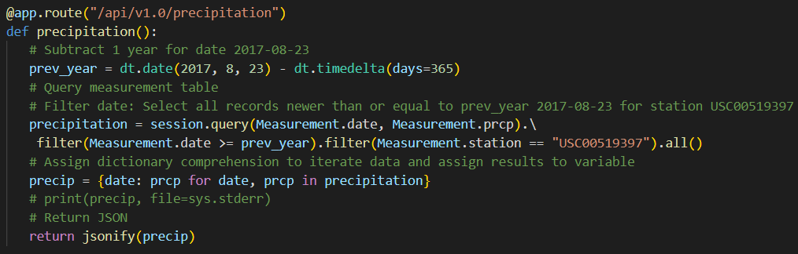
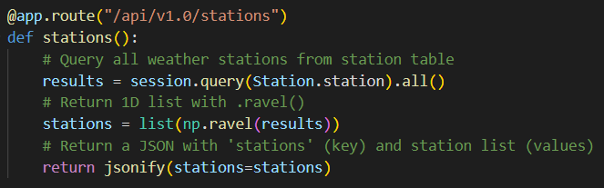

# Flask API Example

Live app: <a href="https://api-flask-example-01.herokuapp.com/" target="_blank">https://api-flask-example-01.herokuapp.com/</a>

### Summary
This repository contains a basic REST API I built with Python and Flask as part of a data analysis course. Additionally, I used NumPy for the math calculations and SQLAlchemy as the object relational mapper (ORM) for the SQLite database.
 
For this exercise I used a SQLite but Flask can be used with many other databases, including PostgreSQL and MS SQL Server. The API principle is the same with any database, the GET request will return a response, on this case in JSON format (e.g., XML is another format). There are of course other HTTP methods like POST, PUT, and DELETE but those are not part of this example.
 
The database contains 2 weather station tables: measurement (measured precipitation and temperature per weather station) and station (weather station info). The dataset contains between 2010 and 2017. The purpose of this basic app is to show that Python, in addition to being used for data science and analysis, can also be used to build robust back-end web applications.
 
 
The 3 available GET routes are listed below:
1. <b>/api/v1.0/precipitation</b> => precipitation (Inch)
   * 
2. <b>/api/v1.0/stations</b> => weather station info
   * 
3. <b>/api/v1.0/tobs</b> => temperature (Fahrenheit)
   * 
4. <b>/api/v1.0/temp/[start]</b> or <b>/api/v1.0/temp/[start]/[end]</b> => start and end are date placeholders, e.g., .../temp/2017-06-01/2017-06-30
   * 
